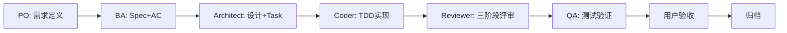

# Hermes Harness

> 通用 SDD（Spec-Driven Development）开发框架 — 让 AI Agent 按工程规范协作

## 解决什么问题

AI Agent 写代码很快，但**写完就忘、质量不稳、流程不透明**。SDD 把人类的软件工程规范（需求→规格→设计→任务→实现→评审→测试→验收）编码为 Agent 可执行的 Skill 流程，让 Agent 像工程团队一样工作。

## SDD 流程



## 快速开始

```bash
# 1. 克隆仓库
git clone https://github.com/NEU-JING/hermes-harness.git
cd hermes-harness

# 2. 安装 Skills 到本地 Hermes Agent
./install.sh

# 3. 在你的项目中初始化 SDD
cd /path/to/your-project
# 对 Hermes Agent 说："初始化 SDD"
```

## 文档

| 文档 | 说明 |
|------|------|
| [安装指南](INSTALL.md) | 详细安装步骤、卸载、升级 |
| [项目模板](templates/) | 接入 SDD 的项目需要的模板文件 |
| [SDD 规则](skills/sdd/shared/sdd-rules.md) | 10 条通用规则定义 |

## 要求

- Hermes Agent >= v2.0
