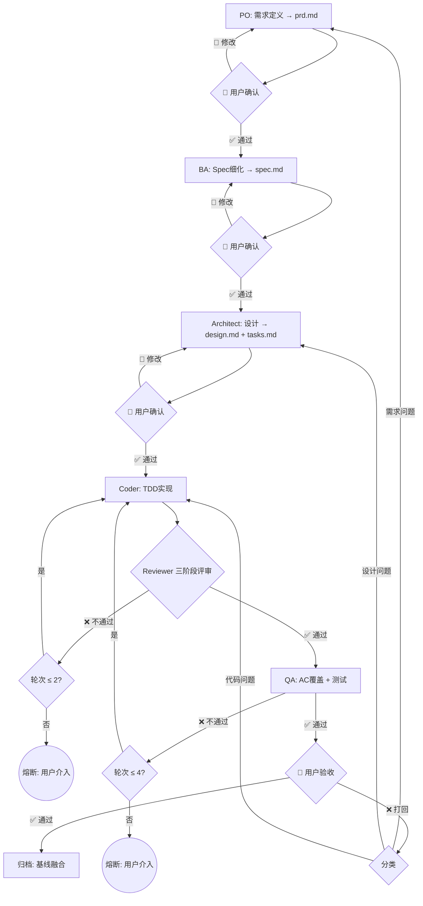

# Hermes Harness

> **让 AI Agent 按工程规范协作——把软件工程流程编码为 Agent 可执行的 Skill。**

AI Agent 写代码很快，但写完就忘、质量不稳、流程不透明。SDD（Spec-Driven Development）把需求→规格→设计→任务→实现→评审→测试→验收的全流程编码为 8 个角色 Skill，让 Agent 像一支工程团队一样工作。

---

## SDD 流程



### 门禁卡点（Gates）

| 位置 | 门禁 | 通过条件 |
|------|------|---------|
| PO → BA | 👤 用户确认 | PRD 目标与范围获认可 |
| BA → Architect | 👤 用户确认 | Spec + AC 获认可 |
| Architect → Coder | 👤 用户确认 | 设计方案 + Task 拆分获认可 |
| Coder → Reviewer | R1（Spec 存在） | `spec.md` 已产出 |
| Reviewer → QA | R4（Review 报告） | Review 结论为"通过"或"有条件通过" |
| QA → 用户验收 | AC 全覆盖 | 所有 AC 有对应测试，全部通过 |
| 用户验收 → 归档 | 用户明确确认 | 场景实现正确 |
| 归档前 | R10（PR 合规） | 代码通过 feature 分支 + PR 合并，非直接 push main |

### 闭环与回退（Fallback）

| 闭环 | 触发条件 | 回退目标 | 上限 |
|------|---------|---------|------|
| Reviewer ↔ Coder | Review 不通过 | Coder 根据 Review 报告修复 | **2 轮** → 熔断，用户介入 |
| QA ↔ Coder | 测试失败 | Coder 修复后重新测试 | **4 轮** → 熔断，用户介入 |
| 用户验收 ↔ 上游 | 场景实现不正确 | 按问题分类打回 PO/Architect/Coder | **2 轮** → 人工裁决 |

> **熔断机制**：回退超过上限后，流程不再自动循环，由人类用户决定下一步（继续修复 / 降级验收 / 取消变更）。

### 流程级别

| 级别 | 适用场景 | 阶段裁剪 |
|------|---------|---------|
| **Quick** | Bug 修复、配置变更 | 跳过 PO/BA，Architect 轻量 → Coder → QA 轻量 |
| **Standard**（默认） | 常规功能开发 | 完整 8 阶段 |
| **Enhanced** | 安全/性能关键 | Standard + 安全审查 + 性能测试 + 灰度验证 |

---

## 快速开始

<details>
<summary><b>Hermes Agent（推荐）</b></summary>

```bash
# 1. 克隆
git clone https://github.com/NEU-JING/hermes-harness.git
cd hermes-harness

# 2. 安装
./install.sh

# 3. 在你的项目中初始化
cd /path/to/your-project
# 对 Hermes Agent 说："初始化 SDD"

# 4. 发起第一个变更
# 对 Hermes Agent 说："用 SDD 流程做 xxx"
```

</details>

<details>
<summary><b>手动安装</b></summary>

```bash
git clone https://github.com/NEU-JING/hermes-harness.git
cp -r hermes-harness/skills/sdd ~/.hermes/skills/sdd/
```

</details>

<details>
<summary><b>其他 Agent 兼容</b></summary>

Skills 是纯 Markdown 文件（SKILL.md + references/），兼容任何支持 system prompt 或 instruction file 的 Agent。将 `skills/sdd/` 目录内容作为 context 注入即可。

</details>

---

## 完整 Skill 目录

### 编排

| Skill | 职责 |
|------|------|
| [sdd-orchestrator](skills/sdd/sdd-orchestrator/SKILL.md) | 流程判定、阶段调度、门禁检查、归档 |

### 定义（Define）

| Skill | 职责 |
|------|------|
| [po-agent](skills/sdd/po-agent/SKILL.md) | 产品负责人——产出 PRD，定义用户场景与功能范围 |
| [ba-agent](skills/sdd/ba-agent/SKILL.md) | 业务分析师——产出 Spec，细化 AC（Given-When-Then） |

### 设计（Design）

| Skill | 职责 |
|------|------|
| [architect-agent](skills/sdd/architect-agent/SKILL.md) | 技术架构师——Brainstorming + Design + Tasks 拆分 |

### 实现（Build）

| Skill | 职责 |
|------|------|
| [coder-agent](skills/sdd/coder-agent/SKILL.md) | 开发者——按 Tasks 逐步实现，TDD 强制 |

### 评审（Review）

| Skill | 职责 |
|------|------|
| [reviewer-agent](skills/sdd/reviewer-agent/SKILL.md) | 代码评审员——三阶段评审（Spec 合规/代码质量/架构一致性） |

### 测试（Verify）

| Skill | 职责 |
|------|------|
| [qa-agent](skills/sdd/qa-agent/SKILL.md) | 测试工程师——AC 覆盖矩阵、测试执行、环境差异、熔断 |

### 基础设施

| Skill | 职责 |
|------|------|
| [sdd-init](skills/sdd/sdd-init/SKILL.md) | 项目初始化 + 升级（支持 init/upgrade 双模式） |
| [sdd-structure-lint](skills/sdd/sdd-structure-lint/SKILL.md) | 文件结构合规检查（3 级：文件/产物/内容） |

### 共享规范

| 文档 | 说明 |
|------|------|
| [sdd-rules.md](skills/sdd/shared/sdd-rules.md) | 10 条通用规则（R1-R10） |
| [flow-level-rules.md](skills/sdd/shared/flow-level-rules.md) | Quick/Standard/Enhanced 判定逻辑 |
| [handoff-protocol.md](skills/sdd/shared/handoff-protocol.md) | Agent 间交接协议 |
| [convention-overrides.md](skills/sdd/shared/convention-overrides.md) | 项目级规则覆盖机制 |
| [git-workflow.md](skills/sdd/shared/git-workflow.md) | Git 分支/PR/合并策略规范 |

---

## 项目结构

```
hermes-harness/
├── README.md                          ← 项目门面
├── INSTALL.md                         ← 安装指南
├── install.sh                         ← 一键安装脚本
├── AGENTS.md                          ← SDD 配置
├── CONSTITUTION.md                    ← 项目宪法
├── templates/                         ← 项目级模板
│   ├── AGENTS.md
│   ├── CONSTITUTION.md
│   ├── QUIRKS.md
│   ├── .pre-commit-config.yaml
│   ├── pytest.ini
│   └── conftest.py
├── skills/sdd/                        ← 8 角色 Skill + shared/
│   ├── sdd-orchestrator/
│   ├── po-agent/
│   ├── ba-agent/
│   ├── architect-agent/
│   ├── coder-agent/
│   ├── reviewer-agent/
│   ├── qa-agent/
│   ├── sdd-init/
│   ├── sdd-structure-lint/
│   └── shared/
└── docs/
    ├── changes/                       ← 进行中的 SDD 变更
    ├── current/                       ← 当前基线（文档地图）
    └── archive/                       ← 已归档变更
```

---

## 设计哲学

### 为什么需要 SDD？

AI Agent 默认走最短路径——跳过 Spec、忽略测试、忘记 Review、直接 push main。这些"捷径"在原型阶段无伤大雅，但在生产级项目中累积成技术债。

SDD 不做 Agent 的替代品——它做 Agent 的**工程规范层**。每个角色 Skill 将软件工程的最佳实践（TDD、Brainstorming、三阶段评审、AC 覆盖矩阵）编码为 Agent 可逐步执行的结构化流程。

### 与 ad-hoc Agent 编码的区别

| 维度 | ad-hoc Agent 编码 | SDD |
|------|------|------|
| 需求 | "帮我做个登录" | PRD → 用户确认 → Spec（Given-When-Then） |
| 设计 | Agent 自定架构 | Brainstorming ≥ 2 方案 + Design 文档 |
| 实现 | 跳过测试直接写 | TDD（RED → GREEN → REFACTOR） |
| 质量 | 写完即忘 | 三阶段评审 + AC 覆盖矩阵 |
| 流程 | 直接 push main | feature 分支 → PR → Review → squash merge |
| 追溯 | 无 | 完整 SDD 产物链（PRD→Spec→Design→Tasks→Review→QA） |

---

## 要求

- **Hermes Agent >= v2.0**

## 文档

| 文档 | 说明 |
|------|------|
| [安装指南](INSTALL.md) | 详细安装步骤、卸载、升级 |
| [项目模板](templates/) | 接入 SDD 的项目需要的模板文件 |
| [项目基线](docs/current/README.md) | 当前生产状态概览 |

## License

MIT — 在项目、团队、工具中自由使用。
