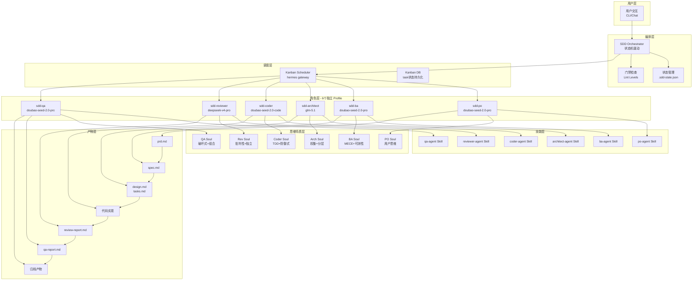

# Hermes SDD 系统架构

> **架构文档**
> 版本：2.3.0 | 最后更新：2026-06-15

---

## 1. 系统概述

Hermes SDD（Spec-Driven Development）是一个**可复用的 Agentic 开发流程引擎**，基于 Hermes Agent 的原生 Profile + Kanban 机制实现多角色协作开发。

### 核心设计理念

1. **零侵入原生集成**: 不修改 Hermes 核心代码，完全基于 Profile + Kanban + Skill 原生机制实现
2. **角色真正差异化**: 每个角色不仅有不同的 Skill，还有独立的**模型配置**和**思维特质(Soul)**
3. **严格状态机驱动**: 流程推进由状态机严格管控，每个阶段门禁检查不通过无法继续
4. **异构评审模式**: Reviewer 角色使用完全独立的模型和 Provider，提供真正的第三方视角

---

## 2. 系统架构图



---

## 3. 变更生命周期数据流

### 完整流程

```
用户发起变更
    │
    ▼
┌─────────────────┐  PO 阶段
│ IDLE → PO_ENTRY │  ─────────────────────► prd.md
│   (状态初始化)   │       用户需求文档
└────────┬────────┘
         │ PO_DONE
         ▼
┌─────────────────┐  BA 阶段
│ PO_DONE → BA_ENTRY │ ───────────────────► spec.md
│   (用户确认推进)   │       功能规格+AC
└────────┬────────┘
         │ BA_DONE
         ▼
┌────────────────────┐  Architect 阶段
│ BA_DONE → ARCH_ENTRY │ ─────────────────► design.md
│     (用户确认推进)   │                     tasks.md
└────────┬────────────┘
         │ ARCHITECT_DONE
         ▼
┌─────────────────────────┐  Coder 阶段
│ ARCH_DONE → CODER_ENTRY │ ──────────────► 代码实现
│    (用户确认开始编码)    │                  completion-report.md
└────────┬────────────────┘
         │ CODER_DONE
         ▼
┌────────────────────────────┐  Reviewer 阶段
│ CODER_DONE → REVIEWER_ENTRY │ ───────────► review-report.md
│       (自动门禁检查)        │               评审结论
└────────┬───────────────────┘
         │ REVIEWER_DONE
         │ ┌─────────────┐
         └─┤  打回 Coder  │  (评审不通过)
           └─────────────┘
         ▼ QA_ENTRY
┌────────────────────────────┐  QA 阶段
│ REVIEWER_DONE → QA_ENTRY    │ ───────────► qa-report.md
│       (自动门禁检查)        │              测试报告
└────────┬───────────────────┘
         │ QA_DONE
         │ ┌─────────────┐
         └─┤  打回 Coder  │  (测试不通过)
           └─────────────┘
         ▼ USER_ACCEPT
┌────────────────────────────┐  Archive 阶段
│ QA_DONE → USER_ACCEPT      │ ───────────► 归档基线
│     (用户验收确认)          │           archive/
└────────┬───────────────────┘
         │ 用户说"归档"
         ▼
      DONE（流程结束）
```

### 每阶段产物传递

| 阶段 | 输入 | 输出 | 门禁级别 |
|------|------|------|---------|
| PO | 用户描述 | prd.md | L1 |
| BA | prd.md | spec.md (含AC) | L1+L2 |
| Architect | spec.md | design.md, tasks.md | L2 |
| Coder | tasks.md + design.md | 代码 + completion-report.md | L2.5 |
| Reviewer | 代码 + spec.md + design.md | review-report.md | L3 |
| QA | review-report.md + 代码 + spec.md | qa-report.md | L3 |
| Archive | 所有产物 | 归档基线 | R10+L3 |

---

## 4. Profile 与 Skill 映射关系

### 映射表

| Profile 名称 | 对应 Skill | 主要职责 | 输入产物 | 输出产物 |
|-------------|-----------|---------|---------|---------|
| **sdd-po** | po-agent | 产品需求分析、用户场景定义、价值优先级排序 | 用户变更描述 | prd.md (用户故事+范围+NFR) |
| **sdd-ba** | ba-agent | 需求细化、AC 编写、边界条件定义、异常场景覆盖 | prd.md | spec.md (含详细 AC) |
| **sdd-architect** | architect-agent | 技术方案设计、模块划分、接口定义、Task 拆解 | spec.md | design.md, tasks.md |
| **sdd-coder** | coder-agent | TDD 实现、代码质量、防御式编程、可测试性 | tasks.md + design.md | 代码实现 + completion-report.md |
| **sdd-reviewer** | reviewer-agent | 异构评审、代码质量检查、架构一致性、安全审查 | 代码 + spec.md + design.md | review-report.md |
| **sdd-qa** | qa-agent | 功能验证、边界测试、集成测试、破坏性测试 | review-report.md + 代码 | qa-report.md |

### Skill 输入输出契约

每个 Skill 必须遵循标准的输入输出格式：

**输入**（通过 Kanban task body 传递）:
```json
{
  "change_id": "001-xxx",
  "current_state": "PO_ENTRY",
  "change_dir": "/path/to/docs/changes/001-xxx",
  "prd_path": "/path/to/prd.md",          // BA 阶段开始有
  "spec_path": "/path/to/spec.md",        // Architect 阶段开始有
  "design_path": "/path/to/design.md",    // Coder 阶段开始有
  "tasks_path": "/path/to/tasks.md",      // Coder 阶段开始有
  "completion_path": "/path/to/completion-report.md",  // Reviewer 阶段
  "review_path": "/path/to/review-report.md"           // QA 阶段
}
```

**输出**:
- 写入 `change_dir` 目录下的对应产物文件
- Kanban 任务状态更新为 `done`

---

## 5. Workspace 工作机制

### dir vs scratch 工作区

| 维度 | `dir:<abs_path>` | `scratch` |
|------|----------------|----------|
| **生命周期** | 永久存在，与任务解绑 | 任务完成后自动删除 |
| **产物持久化** | ✅ 自动写入项目目录 | ❌ 产物丢失 |
| **跨阶段共享** | ✅ 各阶段共享同一目录 | ❌ 每个任务独立 |
| **Git 提交** | ✅ 产物在 Git 工作区内 | ❌ 不在 Git 内 |
| **适用场景** | SDD 开发流程、多阶段任务 | 一次性探索、POC、数据处理 |

### 路径绑定原理

```
Orchestrator 创建 Kanban 任务时:
    --workspace dir:/absolute/path/to/hermes-harness
                            │
                            ▼
Kanban Worker spawn 时:
    cd /absolute/path/to/hermes-harness
    hermes chat -q "work kanban task xxx"
                            │
                            ▼
产物写入:
    docs/changes/{change_id}/prd.md
    docs/changes/{change_id}/spec.md
    ...（与项目目录结构一致）
```

### 跨会话一致性保障

**关键实现点**:
1. **使用脚本位置推导绝对路径**（不依赖 CWD）:
   ```python
   # orchestrator.py
   project_root = Path(__file__).resolve().parents[4]
   ```

2. **路径验证**: 创建 Kanban 任务前验证目录存在性

3. **变更目录使用 change_id**: 每个变更有唯一的 ID，产物路径可预测

---

## 6. 版本兼容性

### Hermes 版本要求

| SDD 框架版本 | 最低 Hermes 版本 | 关键依赖特性 |
|-------------|----------------|------------|
| 2.3.0 | v2.1.0+ | Profile 功能、Kanban `--assignee`、`--skill` 参数 |
| 2.2.0 | v2.0.0+ | 基础 Kanban 调度、Profile 基础功能 |
| 2.1.0 | v2.0.0+ | delegate_task 模型参数支持 |

### 降级方案

如果 Hermes 版本 < v2.1.0：

1. **Profile 功能不可用**: 退化为单模型多 Skill 模式
2. **Kanban 调度不可用**: 退化为 orchestrator 直接调用 delegate_task
3. **手动模式**: 用户手动执行各阶段，不依赖自动化调度

### 检测方法

```bash
# 检查 Hermes 版本
hermes --version

# 检查 Profile 支持
hermes profile --help

# 检查 Kanban 支持
hermes kanban --help
```

---

## SDD Profile 架构概述（由 AGENTS.md 迁移至此）

Hermes SDD 框架采用 **Profile + Soul 双层差异化架构**，实现真正的角色分离：

```
┌─────────────────────────────────────────────────────────────────┐
│                        Profile 层（配置层）                       │
│  ┌──────────────┐  ┌──────────────┐  ┌──────────────┐            │
│  │ 模型配置     │  │ Provider配置  │  │ 工具集权限   │            │
│  └──────────────┘  └──────────────┘  └──────────────┘            │
└─────────────────────────────────────────────────────────────────┘
                              │
                              ▼
┌─────────────────────────────────────────────────────────────────┐
│                          Soul 层（思维层）                       │
│  ┌──────────────┐  ┌──────────────┐  ┌──────────────┐            │
│  │ 角色定义     │  │ 思维模式     │  │ 输出风格     │            │
│  └──────────────┘  └──────────────┘  └──────────────┘            │
└─────────────────────────────────────────────────────────────────┘
```

**核心原理**: Kanban 调度器使用 `hermes -p <profile>` 启动 Worker，每个 Profile 独立加载自己的 `config.yaml`（模型/Provider）和 `SOUL.md`（思维特质），实现零侵入的角色差异化。

### Profile 能力矩阵

| 角色 | Profile 名称 | 推荐模型 | Provider | Soul 核心特质 | 对应 Skill |
|------|-------------|---------|----------|--------------|-----------|
| **PO** | sdd-po | deepseek-v4-flash | DeepSeek | 用户思维、场景化、价值导向 | po-agent |
| **BA** | sdd-ba | deepseek-v4-flash | DeepSeek | MECE、边界清晰、可测性优先 | ba-agent |
| **Architect** | sdd-architect | deepseek-v4-flash | DeepSeek | 权衡分析、分层设计、演进式思维 | architect-agent |
| **Coder** | sdd-coder | deepseek-v4-flash | DeepSeek | TDD、防御式编程、可读性优先 | coder-agent |
| **Reviewer** | sdd-reviewer | deepseek-v4-pro | DeepSeek | 批判性、三阶段评审、异质视角 | reviewer-agent |
| **QA** | sdd-qa | deepseek-v4-flash | DeepSeek | 破坏式、组合覆盖、回归意识 | qa-agent |

### Soul 模式配置

Soul 模式是每个 Profile 的 `SOUL.md` 文件，定义该角色的**思维特质、决策倾向、输出风格**。详见 `docs/PROFILES-GUIDE.md`。

### Workspace 配置

SDD 流程使用 `dir:<绝对路径>` 类型的 workspace，确保产物跨会话持久化。由 orchestrator.py 从项目根目录推导。
