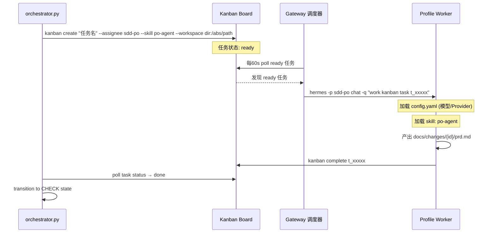

# SDD Orchestrator v2.6.0 — 严格状态机编排器

## Overview

编排器是 SDD 流程的**中央状态机**。职责：
1. **状态管理**：维护 `.sdd-state.json`，驱动状态机推进
2. **门禁强制**：每个状态转换必须通过对应Level的lint检查
3. **Agent委托**：**Kanban + Profile** 原生调度（零源码修改）— orchestrator 创建 `hermes kanban create --assignee <profile>` 任务，Gateway 调度器自动 `hermes -p <profile>` 执行
4. **流程管控**：任何偏离都阻断，必须修复后才能继续
5. **角色模型分级**：每个 Profile 的 `config.yaml` 独立配置模型/Provider

**核心原则**：编排器不直接产出文档，只负责**状态推进和Agent调度**。

> **🔴 重要原则**：用户明确禁止修改 Hermes 源码。必须始终使用原生机制（Kanban + Profile），绝不能改 `/usr/local/lib/hermes-agent/` 下的代码。

> **✅ 正确架构（v2.3.0）**：SDD 状态机负责流程编排，**Kanban 负责真正的 Profile 调度**。`kanban_create(assignee="<profile_name>")` → 调度器自动 `hermes -p <profile>` 执行任务，每个 Profile 有独立的模型配置。**每角色一个独立 Profile**，支持异构评审模式（Reviewer 使用完全不同的 Provider）。

---

## State Machine（状态机）

### Standard 流程状态图

```
┌─────────┐    init     ┌─────────┐   lint L1   ┌─────────┐
│  IDLE   │ ──────────▶ │   PO    │ ──────────▶ │  PO_    │
│ (start) │             │ (entry) │             │ CHECK   │
└─────────┘             └────┬────┘             └────┬────┘
                             │                        │
                             │ kanban create sdd-po      │ lint pass?
                             │ ◀──────────────────────┘
                             │ NO: retry/block
                             │ YES: proceed
                             ▼
                       ┌─────────┐    user     ┌─────────┐
                       │  PO_    │ ──────────▶ │   BA    │
                       │  DONE   │   confirm   │ (entry) │
                       └────┬────┘             └────┬────┘
                            │                       │
                            ▼                       ▼
                      [prd.md created]        [lint + kanban
                                                create sdd-ba]

┌─────────┐   user    ┌─────────┐   lint    ┌─────────┐   kanban    ┌─────────┐
│   BA    │ ────────▶ │  BA_    │ ───────▶ │ARCHITECT│ ───────────▶ │ ARCH_   │
│  DONE   │ confirm   │ CHECK   │  pass   │ (entry)  │ create sdd- │ CHECK   │
└─────────┘           └─────────┘         └────┬────┘   architect   └────┬────┘
                                               │                        │
                                               ▼                        ▼
                                         [design.md +              [lint pass?
                                          tasks.md created]          user confirm?]
┌─────────┐   lint    ┌─────────┐   kanban   ┌─────────┐   lint    ┌─────────┐
│ CODER   │ ───────▶ │ CODER_  │ ───────────▶ │REVIEWER │ ───────▶ │ REVIEW_ │
│(entry)  │  L2.5    │ CHECK   │  create sdd-│(entry)   │  L3      │ CHECK   │
│         │          │         │  reviewer   │          │          │         │
└────┬────┘          └────┬────┘              └────┬────┘          └────┬────┘
     │ kanban create      │ tasks all done?        │ review passed?    │
     │ sdd-coder          │ NO: continue           │ NO: back to coder │
     │ (per task)         │ YES: proceed           │ YES: proceed      │
     ▼                    ▼                        ▼                   ▼
[commits]           [task reports]          [review-report.md]   [conclusion]

┌─────────┐   lint    ┌─────────┐   kanban   ┌─────────┐   user    ┌─────────┐
│   QA    │ ───────▶ │  QA_    │ ───────────▶ │  USER   │ ───────▶ │ARCHIVE_ │
│(entry)  │  pass   │ CHECK   │   create     │ACCEPT   │ confirm   │ENTRY    │
│         │         │         │   sdd-qa      │         │           │         │
└────┬────┘         └────┬────┘              └────┬────┘           └────┬────┘
     │                   │                        │                    │
     │                   │ qa passed?             │                    │ R10 + L3
     │                   │ NO: back to coder      │                    │
     │                   │ YES: proceed           │                    ▼
     ▼                   ▼                        ▼               [archive done]
[tests run]        [qa-report.md]         [user says "归档"]
```

### 状态定义摘要

| 状态 | 类型 | 说明 | 产物检查 |
|------|:---:|:---|:---|
| `IDLE` | 初始 | 流程未开始 | 无 |
| `PO_ENTRY` | 执行 | PO Agent执行中 | `.sdd-state.json` 存在 |
| `PO_CHECK` | 门禁 | L1检查PRD | `changes/{id}/prd.md` |
| `PO_DONE` | 等待 | 等待用户确认 | `changes/{id}/prd.md` 存在 |
| `BA_ENTRY` | 执行 | BA Agent执行中 | `prd.md` 存在 |
| `BA_CHECK` | 门禁 | L1+L2检查Spec | `changes/{id}/spec.md` |
| `BA_DONE` | 等待 | 等待用户确认 | `spec.md` 存在 |
| `ARCHITECT_ENTRY` | 执行 | Architect Agent执行中 | `spec.md` 存在 |
| `ARCHITECT_CHECK` | 门禁 | L2检查Design+Tasks | `changes/{id}/design.md` + `tasks.md` |
| `ARCHITECT_DONE` | 等待 | 等待用户确认 | Design + Tasks 存在 |
| `CODER_ENTRY` | 执行 | Coder Agent执行中 | `tasks.md` + Git clean |
| `CODER_CHECK` | 门禁 | L2.5检查代码+报告 | Task完成报告 + commits |
| `REVIEWER_ENTRY` | 执行 | Reviewer Agent执行中 | 代码已提交 |
| `REVIEWER_CHECK` | 门禁 | L3检查Review报告 | `changes/{id}/review-report.md` |
| `QA_ENTRY` | 执行 | QA Agent执行中 | Review通过 |
| `QA_CHECK` | 门禁 | L3检查QA报告 | `changes/{id}/qa-report.md` |
| `USER_ACCEPT` | 等待 | 等待用户验收确认 | QA通过 |
| `CODER_FIX` | 执行 | Review打回后Coder批量修复 | Review报告 + Issue清单 |
| `ARCHIVE_ENTRY` | 执行 | 归档执行中 | 用户确认 |
| `DONE` | 终止 | 流程完成 | 归档完成 |
| `BLOCKED` | 终止 | 流程阻断 | 需人工介入 |

### 转换矩阵

| 当前状态 | 触发条件 | 下一状态 | Lint Level | 用户确认 |
|---------|---------|---------|:----------:|:--------:|
| `IDLE` | `sdd start` | `PO_ENTRY` | L1 | ❌ |
| `PO_ENTRY` | po-agent完成 | `PO_CHECK` | L1 | ❌ |
| `PO_CHECK` | lint通过 | `PO_DONE` | — | ❌ |
| `PO_DONE` | 用户说"继续" | `BA_ENTRY` | — | ✅ |
| `BA_ENTRY` | ba-agent完成 | `BA_CHECK` | L1+L2 | ❌ |
| `BA_CHECK` | lint通过 | `BA_DONE` | — | ❌ |
| `BA_DONE` | 用户说"继续" | `ARCHITECT_ENTRY` | — | ✅ |
| `ARCHITECT_ENTRY` | architect-agent完成 | `ARCHITECT_CHECK` | L2 | ❌ |
| `ARCHITECT_CHECK` | lint通过 | `ARCHITECT_DONE` | — | ❌ |
| `ARCHITECT_DONE` | 用户说"开始编码" | `CODER_ENTRY` | — | ✅ |
| `CODER_ENTRY` | coder-agent完成 | `CODER_CHECK` | L2.5 | ❌ |
| `CODER_CHECK` | lint通过 | `REVIEWER_ENTRY` | — | ❌ |
| `REVIEWER_ENTRY` | reviewer-agent完成 | `REVIEWER_CHECK` | L3 | ❌ |
| `REVIEWER_CHECK` | review通过 | `QA_ENTRY` | — | ❌ |
| `REVIEWER_CHECK` | review不通过 | `CODER_ENTRY` | — | ❌ |
| `QA_ENTRY` | qa-agent完成 | `QA_CHECK` | L3 | ❌ |
| `QA_CHECK` | qa 通过 | `USER_ACCEPT` | — | ❌ |
| `QA_CHECK` | qa 不通过 | `CODER_ENTRY` | — | ❌ |
| `REVIEWER_CHECK` | review 不通过（fixable） | `CODER_FIX` | — | ❌ |
| `CODER_FIX` | fix 完成 + commit | `REVIEWER_ENTRY` | L2.5 | ❌ |
| `CODER_FIX` | fix 超 5 轮 | `BLOCKED` | — | ✅ 熔断 |
| `USER_ACCEPT` | 用户说"归档" | `ARCHIVE_ENTRY` | — | ✅ |
| `ARCHIVE_ENTRY` | 归档完成 | `DONE` | R10+L3 | ❌ |

> **详细状态定义**见 [state-machine.md](./references/state-machine.md)

---

## Agent Delegation via Kanban + Profile（Agent委托）

编排器使用 **Kanban + Profile 原生机制**调度各角色Agent。**不需要调用 `delegate_task`**，不支持 `profile` 参数（delegate_task 签名中不存在）。

> ⚡ 这是经过实战验证的、唯一可行的委托模式。详见 [kanban-profile-integration.md](./references/kanban-profile-integration.md)

### Agent 委托流程



### orchestrator.py 实现

```python
def delegate_agent(self, change_id, state):
    role = STATE_ROLE_MAP.get(state)
    profile = self.get_profile_for_role(role)
    
    # 创建 Kanban 任务 — 调度器自动 spawn 对应 Profile
    result = subprocess.run(
        ["hermes", "kanban", "create",
         f"{change_id}: {state_name} 阶段",
         "--assignee", profile,        # → 调度器自动 hermes -p <profile>
         "--skill", agent_skill,
         "--body", task_body,
         "--workspace", f"dir:{self.project_root.resolve()}"],
        capture_output=True, text=True
    )
    
    # 轮询任务完成
    task_id = extract_task_id(result.stdout)
    poll_task_completion(task_id)  # 每10s检查一次
```

### 关键参数说明

| 参数 | 说明 | 陷阱 |
|------|------|------|
| `title` | **位置参数**，无 `--title` flag | v2.4.0: `--title` 不存在 |
| `--assignee` | Profile 名称（如 sdd-po） | 必须对应已存在的 Profile |
| `--skill` | **单数**，无 `--skills` | v2.4.0: `--skills` 报错 |
| `--workspace` | `dir:<绝对路径>`，非 `.` | 跨会话产物持久化需要 |

### 状态机 → 角色映射

| 状态 | 角色 | Profile | Skill |
|------|:----:|:-------:|:-----:|
| `PO_ENTRY` | po | `sdd-po` | po-agent |
| `BA_ENTRY` | ba | `sdd-ba` | ba-agent |
| `ARCHITECT_ENTRY` | architect | `sdd-architect` | architect-agent |
| `CODER_ENTRY` | coder | `sdd-coder` | coder-agent |
| `REVIEWER_ENTRY` | reviewer | `sdd-reviewer` | reviewer-agent |
| `QA_ENTRY` | qa | `sdd-qa` | qa-agent |

> **异构评审**：Reviewer 使用 `sdd-reviewer` Profile，通过独立的 DeepSeek Provider + deepseek-v4-pro 模型评审，确保第三方视角无偏见。

> **详细规范**见 [kanban-profile-integration.md](./references/kanban-profile-integration.md)

---

## Phase Gates（阶段门禁）

每个状态转换必须通过对应Level的lint检查。

### Lint Level 映射

| 状态转换 | Lint Level | 检查内容 |
|---------|:----------:|---------|
| `IDLE → PO_ENTRY` | L1 | 目录结构初始化 |
| `PO_ENTRY → PO_CHECK` | L1 | PRD文件存在、格式正确 |
| `BA_ENTRY → BA_CHECK` | L1+L2 | Spec文件存在、AC格式正确 |
| `ARCHITECT_ENTRY → ARCHITECT_CHECK` | L2 | Design+Tasks存在、格式正确 |
| `CODER_ENTRY → CODER_CHECK` | L2.5 | Task完成、commits存在 |
| `REVIEWER_ENTRY → REVIEWER_CHECK` | L3 | Review报告存在、结论明确 |
| `QA_ENTRY → QA_CHECK` | L3 | QA报告存在、AC覆盖完整 |
| `ARCHIVE_ENTRY → DONE` | R10+L3 | PR merged、归档结构正确 |

### 门禁执行流程

```python
def phase_gate_transition(current_state, next_state):
    """状态转换门禁检查"""
    
    # 1. 确定需要的lint level
    lint_level = get_lint_level(current_state, next_state)
    
    # 2. 执行lint检查（强制，不通过则阻断）
    result = run_sdd_structure_lint(
        level=lint_level,
        change_id=current_change_id,
        path=f"docs/changes/{current_change_id}"
    )
    
    if not result.passed:
        # 阻断：不转换状态，返回错误报告
        update_state_json({
            "state": current_state,
            "blocked_reason": result.errors,
            "last_check": "failed"
        })
        return PhaseGateResult(success=False, errors=result.errors)
    
    # 3. 通过：更新状态并推进
    update_state_json({
        "state": next_state,
        "last_check": "passed",
        "updated_at": now()
    })
    
    return PhaseGateResult(success=True, next_state=next_state)
```

> **详细门禁检查规范**见 [phase-gates.md](./references/phase-gates.md)

---

## 使用方式

### 启动新变更

```
用户：用SDD流程做用户登录功能

编排器：
1. 判定流程级别：Standard
2. 创建 changes/006-user-login/ 目录
3. 初始化 .sdd-state.json: { state: "IDLE", ... }
4. 状态转换：IDLE → PO_ENTRY（自动触发 kanban create --assignee sdd-po）
5. orchestrator 创建 Kanban 任务，Gateway 自动 spawn Profile Worker
6. 等待 Profile Worker 完成（orchestrator 每10s轮询状态）
8. 状态转换：PO_ENTRY → PO_CHECK（执行L1 lint）
9. lint通过 → PO_DONE
10. 等待用户确认...
```

### 用户确认指令

| 当前状态 | 用户指令 | 动作 |
|---------|---------|------|
| `PO_DONE` | "继续"/"下一步" | → `BA_ENTRY` |
| `BA_DONE` | "继续"/"下一步" | → `ARCHITECT_ENTRY` |
| `ARCHITECT_DONE` | "开始编码" | → `CODER_ENTRY` |
| `USER_ACCEPT` (Standard / 最终Phase) | "归档" | → `ARCHIVE_ENTRY` |
| `USER_ACCEPT` (增量模式 — 非最终Phase) | "已授权"/"继续" | ⚠️ 验收后不归档 — 需走 **PR Merge + State Sync**。**不要主动询问"是否继续推进下一 Phase"**——等用户主动开口。详见 [incremental-mode.md](./references/incremental-mode.md#非最终-phase-验收后工作流post-acceptance-workflow) |
| 任意等待状态 | "状态" | 输出当前状态和产物 |
| 任意状态 | "中断" | 保存状态，可恢复 |

---


## Common Pitfalls

1. **跳过门禁检查**：编排器必须强制执行lint，不能依赖agent自律
2. **状态不同步**：每次状态转换必须立即更新 `.sdd-state.json`
3. **Kanban 上下文不全**：`kanban create --body` 必须包含完整的前置产物路径、完成标准和约束条件
4. **用户确认缺失**：PO_DONE/BA_DONE/ARCHITECT_DONE/USER_ACCEPT必须等待用户确认
5. **Profile 负责技能加载**：Kanban Worker 在 spawn 时通过 `--skill` 参数自动加载，无需 agent 内自主调用 `skill_view`
6. **🔴 验收后不要自动询问下一 Phase**：增量模式非最终 Phase 验收后（用户说"已授权"），禁止主动问"是否继续推进下一 Phase"。验收决定和启动下一 Phase 是独立决策。正确做法：完成 PR Merge + State Sync 后直接结束，等待用户主动开口。
7. **恢复状态错误**：恢复时要重新检查当前状态产物是否存在，不存在则回退
8. **增量模式状态复杂**：Phase级状态需要额外维护 sub_phase_status
9. **Profile 创建 CLI 不匹配**：`hermes profile create` 仅接受 `--description`，不支持 `--model`/`--tools`。模型和工具集需通过 profile 的 config.yaml 或继承 main config 配置。
10. **⚠️ AGENTS.md 解析器必须验证段边界**：解析 `sdd_config.role_to_profile` 时，必须先检测 `role_to_profile:` 段入口，并只匹配段内的有效角色键（po/ba/architect/coder/reviewer/qa）。直接全文件正则匹配会误抓 `convention_overrides` 段的 YAML 键值对，导致 Profile 模式在用户未 opt-in 时错误启用。
11. **Review 打回 Coder 后必须修复全部级别**：当 `REVIEWER_CHECK` 转换到 `CODER_FIX` 时，Coder 必须修复**所有**严重级别的问题（CRITICAL + MAJOR + MINOR + INFO），而非仅修复阻塞项。只修 CRITICAL 会导致后续 Review 再次打回。
12. **`coder_fix` 状态与 `coder_entry` 不同**：
    - `CODER_ENTRY`: 从零开始实现新 Task，遵循 RED→GREEN→REFACTOR 循环
    - `CODER_FIX`: 基于 Review Report 的 Issue 清单做定向修改，不需要重新写测试，但修改后必须运行全量测试确认不回归
    - `CODER_FIX` 应将所有修复放在一个 commit 中（而非每 Task 一 commit），方便 Reviewer 一次性验证
13. **Coder 提交必须走特征分支，不能直接 main**：Coder 在实现过程中必须将代码推送到 SDD 特征分支（如 `feature/{change_id}`），而非直接提交到 `main`。直接提交到 main 会绕过 PR 流程。**预防**：编码开始前 `git branch` 确认不在 `main` 上。**修复**：如果代码已落入 main，按 `references/pr-and-review-flow.md` 的「Retroactive PR 模式」处理。
15. **🔥 归档产物必须先提交到 feature 分支，再 Squash Merge**：归档创建的文件（`docs/specs/` 基线、`docs/current/design.md`、`manifest.json`、`archive/*`）必须在 feature 分支上 `git add && git commit` → push → 然后才切 main squash merge。如果先 merge 再归档，基线文件会丢失（它们只在 feature 分支上，不在 main 上）。正确的顺序：archive commit on feature → squash → main cleanup。
16. **🔥 SDD 产物分两类处理**：`prd.md` / `design.md` / `tasks.md` / `review-report.md` / `qa-report.md` 通常是**未跟踪文件**（存在于磁盘但不 git tracked），归档时用 `cp` 复制而非 `mv` 到 archive/（因为 uncommitted changes 不能 mv 到已跟踪位置）。而 `spec.md` / `.sdd-state.json` 可能是**已跟踪文件**（如果被修复提交纳入），归档复制后需在 main 上 `git rm` 清理。混淆这两类会导致文件丢失或 git 状态异常。
17. **🔥 上下文压缩后验证项目根目录 ≠ 相信压缩摘要**：当 Hermes 触发上下文压缩（CONTEXT COMPACTION）时，压缩摘要中的项目路径/目录可能是错的（例如摘要说 `/root/workspace/hermes-harness` 但实际项目是 `/root/workspace/ai-learning-platform`）。**恢复 SDD 工作前必须先做三件事**：
    - `pwd` + `ls` 确认当前工作目录
    - `git remote -v` 验证远程仓库地址
    - `git branch --show-current` 确认分支 + `git log --oneline -3` 验证最后提交
    - 搜索 `.sdd-state.json`：`find . -name '.sdd-state.json' -not -path '*/archive/*'` — 不假定固定路径
    如果发现项目路径与压缩摘要不符，**以实际文件系统和 git 状态为准**，并更新相关记忆（`memory` 工具）修正项目根目录。
18. **🔴 修改 Hermes 源码是被禁止的**：用户明确表示「不同意，涉及改动代码的方案，我都不会同意」。任何需要修改 `/usr/local/lib/hermes-agent/` 下源码的方案都不能采用，必须使用 Hermes 原生机制。
21. **⚠️ Profile 创建 CLI 参数注意事项**：`hermes profile create` 只接受 `--description`，不支持 `--model`/`--tools`。模型和工具集必须通过 Profile 的 `~/.hermes/profiles/<name>/config.yaml` 配置。
22. **🔥 异构评审模式（Heterogeneous Review）**：Reviewer 角色应使用**完全不同的 Provider** 来提供真正的第三方视角。例如：
    - 所有开发角色（PO/BA/Architect/Coder/QA）：火山引擎自定义 Provider + doubao 系列模型
    - Reviewer 角色：原生 DeepSeek Provider + deepseek-v4-pro
    - 这样 Reviewer 不会因使用同一模型而产生偏见，评审更客观独立
24. **✅ 模型可用性验证流程**：配置 Profile 模型前，先验证该 Provider 下确实有此模型端点：
    ```bash
    curl -H "Authorization: Bearer *** "<base_url>/models" | jq '.data[].id' | sort
    ```
    不要轻信文档或记忆，尤其是火山引擎这类自定义 Provider，可用模型列表可能与预期不符。

27. **✅ 6角色标准模型映射（v2.4.1 实战修正版）**：
    > **🔴 实战教训（2026-06-16）**：模型选择的**第一优先级是输出长度上限**，其次才是推理能力。BA/Architect 阶段用小输出模型会导致生成被截断，任务失败。

    | Profile | 模型 | Provider | 核心理由 |
    |---|---|---|---|
    | sdd-po | doubao-seed-2.0-pro | 火山引擎 | 需求文档（~200行），推理适中 |
    | sdd-ba | **deepseek-v4-pro** | DeepSeek | Spec文档（~500行+详细AC），**输出长度优先** |
    | sdd-architect | **deepseek-v4-pro** | DeepSeek | 设计文档（~300行），输出长度+强推理 |
    | sdd-coder | doubao-seed-2.0-code | 火山引擎 | 代码实现，按Task拆分输出可控 |
    | sdd-reviewer | deepseek-v4-pro | DeepSeek | 异构评审，不同Provider防偏见 |
    | sdd-qa | doubao-seed-2.0-pro | 火山引擎 | 测试验证，推理适中 |

    **为什么 BA/Architect 必须用大输出模型**：
    - doubao-seed-2.0-pro max output ≈ 2000 tokens → 不足以生成完整 spec.md
    - deepseek-v4-pro max output ≈ 8000 tokens → 可以一次性生成长文档
    - 实战复现：BA 阶段用 doubao 会触发 `finish_reason='length'` 截断，write_file 参数不完整导致任务 blocked

28. **🔥 Workspace 路径必须用绝对路径（v2.4.0 修复）**：
    ```python
    # ❌ 错误：相对路径依赖 CWD，跨会话执行路径不一致
    workspace_path = "dir:."

    # ✅ 正确：从 orchestrator 脚本位置推导项目根目录（绝对路径）
    project_root = Path(__file__).resolve().parents[4]  # skills/sdd/sdd-orchestrator/scripts → 项目根
    workspace_path = f"dir:{project_root}"
    ```
    - 绝对路径确保跨会话/跨阶段产物不会丢失
    - 变更目录始终在正确的项目位置创建
    - 参考：`scripts/orchestrator.py` delegate_agent() 实现

29. **✅ Profile+Soul 双层差异化架构（v2.4.0）**：
    每个 SDD Profile 应该包含两层配置：
    - **Layer 1: config.yaml** — 模型、Provider、工具集等客观配置
    - **Layer 2: SOUL.md** — 角色的思维特质、决策倾向、输出风格（人格层）
    > 示例：Reviewer 的 SOUL.md 定义「批判性思维、三阶段评审、对事不对人」等特质，而非只是任务指令。详见 `references/profile-soul-architecture.md`

30. **⚠️ PowerUser 模式 vs Kanban 调度模式**：
    - **Kanban 调度模式（默认，生产环境）**：适合无人值守、Gateway 自动执行。用 `hermes kanban create`，调度器每 60s 自动 pick up。优点：真正的 Profile 隔离，各阶段用不同模型。
    - **PowerUser 模式（手动，调试）**：适合会话内快速迭代，跳过等待。orchestrator 直接调用工具，不通过 Kanban。优点：速度快，适合调试。缺点：所有阶段用同一个会话模型，失去 Profile 差异化。
    - **切换到 PowerUser 的合法触发条件**：
      1. Profile API Key 过期/无效（401 错误）—— 切换到当前会话的可用模型继续
      2. Gateway 未启动或不可达
      3. 调试/开发框架本身（当前正修改 SDD 框架时）
      4. 快速原型验证（探查性变更）
    - **最佳实践**：开发/调试用 PowerUser 模式，生产/正式项目用 Kanban 调度模式。切换时在 `.sdd-state.json` 的 metadata 中记录 `power_user: true` 和切换原因。

31. **🔐 严格流程执行的硬约束清单（强制执行）**：
    > 用户明确要求：必须按流程推进，不能跳步、不能手动改产物、不能手动调用 Profile Worker。

    每次操作前必须按顺序检查：
    1. ✅ 加载 sdd-orchestrator 技能（确保规范是最新的）
    2. ✅ `orchestrator.py status` 确认当前状态
    3. ✅ `hermes kanban list` 确认对应任务状态
    4. ✅ `ls -la docs/changes/<id>/` 确认产物状态
    5. ✅ 对照状态机转换矩阵，确认操作在白名单内
    6. ✅ 绝对不手动修改 `docs/changes/` 下的任何文件
    7. ✅ 绝对不手动调用 `hermes -p <profile> chat` 抢调度器的活

    只要违反任何一条，立即重置回上一状态。

32. **🔴 实战验证的 P0/P1 级陷阱（踩过的坑）**：
    | # | 陷阱 | 现象 | 严重程度 | 规避方法 |
    |---|------|------|---------|---------|
    | 1 | **Agent 协议违反** | Agent 执行完成但不调用 `kanban_complete`，调度器认为任务崩溃，重试 2 次后标记 blocked | P0 | Agent skill 必须确保退出前调用 kanban_complete 或 kanban_block |
    | 2 | **模型输出截断** | BA/Architect 阶段模型 hit max output tokens，write_file 参数不完整，任务静默失败 | P0 | BA/Architect 必须用大输出模型（deepseek-v4-pro），不能用 doubao 系列 |
    | 3 | **Orchestrator 不轮询** | orchestrator 创建完 Kanban 任务就撒手，不会自动检查任务状态，必须手动 transition | P0 | orchestrator 需新增轮询机制，每 10s 检查一次 Kanban 任务状态，完成后自动推进 |
    | 4 | **门禁太弱形同虚设** | L1/L2 检查只验证"文件存在"，不验证内容质量，垃圾产物也能过 | P1 | 门禁必须检查章节完整性、格式合规性、内容非空 |
    | 5 | **无模型使用审计** | 事后无法验证各阶段实际用了什么模型，Profile 隔离是否真的生效 | P1 | 每个阶段完成后在 .sdd-state.json 中记录：模型、Provider、Kanban 任务ID |

31. **🔴 编排器是可执行程序，不是参考文档**：这是最常见的入门错误。
    - **错误做法**：阅读 orchestrator.py 代码和 SKILL.md，然后手动创建目录、写 prd.md、模拟状态转换
    - **正确做法**：`python3 skills/sdd/sdd-orchestrator/scripts/orchestrator.py start "变更描述"` — 让程序自己驱动整个流程
    - **为什么重要**：手动模拟会跳过门禁检查、状态历史记录、Profile 调度等核心机制，导致"看起来流程对了，但实际上机制根本没工作"
    - **验证标准**：执行 `orchestrator.py status` 能看到完整的状态转换历史，每个阶段产物是由 Kanban Worker 生成的，不是你手动写的

32. **⚠️ Kanban 任务手动执行技巧**：
    - 调度器默认每 60s 自动 pick up 任务，会话内等待会超时
    - **手动加速技巧**：`hermes -p <profile> chat -q "work kanban task <task_id>"` 立即执行
    - 任务状态变化：`ready` → `running` → `done`，产物会自动写入 workspace 目录
    - 任务完成后，需要手动调用 `orchestrator.py transition` 推进到下一个状态/门禁

33. **✅ 正确的 SDD 启动步骤（会话内验证用）**：
    ```bash
    # 1. 清理之前的错误尝试
    rm -rf docs/changes/*

    # 2. 用 orchestrator 正式启动
    python3 skills/sdd/sdd-orchestrator/scripts/orchestrator.py start "变更描述"

    # 3. 查看 Kanban 任务 ID
    hermes kanban list

    # 4. 手动执行任务（跳过 60s 等待）
    hermes -p sdd-po chat -q "work kanban task t_xxxxxx"

    # 5. 验证产物生成
    ls -la docs/changes/<change_id>/

    # 6. 推进到门禁检查
    python3 orchestrator.py transition <change_id> PO_CHECK
    ```

44. **🔴 Pre-audit: 修复 N 个问题前先做全面扫描**：用户说"修复这 3 个问题"，但实际上相关问题往往远超用户报告的 — 实战历史：用户报告 3 个不一致，扫描后实际发现 7+ 个附加问题（QUIRKS.md 缺失、版本不匹配、8/10 归档缺少 specs/、废弃文件残留等）。修复前必须先执行完整 scan：

    ```bash
    # 必须做的前置扫描
    python3 skills/sdd/sdd-orchestrator/scripts/orchestrator.py status   # 所有变更状态
    ls docs/archive/*/   # 归档结构完整性
    skill_view(name='sdd-structure-lint')  # 加载后执行 Level 1 + Level 4
    ```

    不做前置扫描的后果：修复了用户报告的 3 个问题，但 L1 门禁被未报告的 QUIRKS.md 缺失阻塞，流程反而倒退。

34. **🔴 执行状态自动跟踪规范（强制执行，用户要求）**：
    > 用户明确反馈："没有跟踪各个子agent的执行状态，还需要我自己去后台检查"。
    > **从现在开始，必须自动跟踪，绝不允许让用户自己去后台看状态**。

    ### 跟踪频率

    ### 跟踪频率
    | 阶段 | 检查频率 |
    |------|---------|
    | 任务启动后 30s | 第一次状态检查 + 日志预览 |
    | 之后每 60s | 状态检查 + 进度报告 |
    | 任务完成后立即 | 产物验证 + 成果物摘要发给用户 |

    ### 每次状态报告必须包含
    ```
    📊 执行状态：[阶段名]
    ├─ 任务 ID: t_xxxxxx
    ├─ Profile: sdd-xxx
    ├─ 模型: xxx-xxx-pro
    ├─ 当前状态: running/done/blocked
    ├─ 已执行时间: X 分钟
    └─ 预期产物: [文件名列表]
    ```

    ### blocked 状态必须立即做
    1. ✅ 抓取完整错误日志：`hermes kanban log <task_id>`
    2. ✅ 根因分析（5 Whys）
    3. ✅ 修复建议（至少2个方案）
    4. ✅ 执行修复（先归档坏任务，再用修复参数创建新任务）

    ### done 状态必须立即做
    1. ✅ 验证产物文件存在且非空：`ls -lh docs/changes/<id>/`
    2. ✅ 产物内容摘要：`head -100 [文件]` 或关键章节预览
    3. ✅ 自动执行 `transition` 到 CHECK 状态
    4. ✅ 打印 lint 检查结果
    5. ✅ 告诉用户"下一步可以说继续了"

    > **核心原则**：用户永远不需要敲 `hermes kanban list`。所有状态变化必须主动推送。

35. **🔴 模型输出截断问题的正确解法（用户明确禁止简单换模型）**：
    > 用户明确纠正：模型输出长度限制是**机制问题**，不是模型选择问题。
    > **绝对不能**简单切换到更大输出的模型来规避问题（例如 BA/Architect 遇到截断就切 deepseek-v4-pro），这是治标不治本的 workaround。
    > **必须**在 Agent 执行机制层面解决，不依赖任何特定模型的输出能力。

    ### 四层一致性保障机制（强制执行）
    | 层级 | 机制 | 解决的问题 |
    |------|------|-----------|
    | **L1 文档地图** | 先生成完整的大纲、术语表、引用注册表、命名约定（控制在 200 行内），所有分块生成时携带 | 全局一致性丢失，术语漂移，引用错误 |
    | **L2 上下文锚定** | 每个分块除文档地图外，额外携带前一章节最后 3 段 + 后一章节大纲 | 相邻章节衔接断裂，过渡语不自然 |
    | **L3 递归分块 + 渐进展开** | 章节还超限制就拆成小节，小节还超就拆成段落，最大深度 3 级。Agent 自动判断是否需要拆分，无需人工干预 | 单个模块/章节本身过大还是会触发输出截断 |
    | **L4 一致性审计 + 合并去重** | 所有分块生成后，自动执行：标题层级检查、重复内容清理、过渡语优化、引用编号修正、术语一致性校验 | 分块拼接后的结构和一致性问题 |

    ### 极端情况降级方案（L3 还超）
    1. 先写要点列表（控制在 10 行内），不写详细说明
    2. 再逐个要点展开（可突破 L3 深度限制）
    3. 在审计报告中标注「⚠️ 此部分分块深度超过 L3，建议人工审核连贯性」

    ### 为什么绝对不能简单换模型
    - ❌ 破坏了我们精心设计的「角色-模型」匹配架构（每个角色应该用最适合其任务的模型，而不是最大输出的模型）
    - ❌ 导致所有角色都用同一个模型，Profile 架构完全失去意义
    - ❌ 治标不治本：总有更大的文档会触发任何模型的输出限制
    - ✅ 机制层面解决：任何模型都可以生成任意长度的文档，不依赖模型的输出能力

    > **用户原话引用**："你这个调整我不能接受，输出阶段问题你必须从机制上解决，而不是简单的切换模型" — 永久生效，所有 SDD 项目必须遵守。
    > **用户原话引用**："你这个调整我不能接受，输出阶段问题你必须从机制上解决，而不是简单的切换模型" — 永久生效，所有 SDD 项目必须遵守。
    ### 参考实现
    完整的四层一致性机制设计和验收标准见：`references/4-layer-document-consistency.md`

36. **🔴 写一致性机制的人自己写的文档不一致**（最讽刺的教训）：
    > **用户原话引用**："我检查了一下你目前的成果物，前后存在不一致的情况... 先别着急编码，我们先把基础打好，必须确保成果物的前后一致性"

    **实战现象**：我写了"三层一致性保障的文档分块生成机制"，但 spec.md 里同时出现了"三层"和"四层"两种表述，Requirement 编号重复（出现两个 R7）。**写一致性保障机制的人，自己产出的文档不一致**，这是最讽刺的反例。

    **强制执行：推进到下一阶段前必须先做内部一致性审计**：
    | 审计项 | 检查内容 | 执行命令 |
    |--------|---------|---------|
    | ✅ 术语一致性 | 全文搜索核心术语（如"三层"/"四层"），确保表述统一 | `grep -c "三层" spec.md && grep -c "四层" spec.md` |
    | ✅ 编号连续性 | Requirement 编号不能重复或跳跃（R1-Rn 必须连续） | `grep "^### Requirement" spec.md \| cat -n` |
    | ✅ 章节编号跳跃 | 章节编号必须连续（不能出现"1. 背景"→"3. 方案"） | 检查 `grep "^## "` 和 `grep "^### "` 编号 |
    | ✅ 前后矛盾 | 搜索"必须"/"禁止"等断言词，检查是否前后矛盾 | 搜索同一概念的正反表述 |
    | ✅ PRD vs Spec 映射 | PRD 中提到的功能点必须在 Spec 中有对应的 R | 人工交叉核对 |

    **核心原则**：
    > 不要让用户帮你发现文档不一致。你是写一致性保障机制的人，必须首先确保你自己写的文档是一致的。
    >
    > 推进到 Architect 阶段前，BA 必须先自我审计；推进到 Coder 阶段前，Architect 必须先自我审计。永远把基础打好，再往下走。
37. **🔥 glm-5.1 模型稳定性问题（火山引擎）**：实战中发现 glm-5.1 模型（火山引擎自定义 Provider）会连续返回空响应（`empty response after retries`），导致 Architect 任务被 blocked。
    - **现象**：Kanban 任务卡在 running 状态，日志显示多次重试后仍无内容
    - **规避方案**：将 Architect Profile 的模型改为 deepseek-v4-pro（DeepSeek Provider），稳定性显著提升
    - **验证方法**：创建任务前先测试模型响应：`echo "test" | hermes -p sdd-architect chat -q "Hello"`
    - **手动 fallback 流程**：如果模型连续失败 2 次，停止重试，改为手动生成产物并更新状态机
    > 注意：这是极端情况的 fallback，不是常规流程。正常情况下必须通过 Kanban + Profile 自动化执行。

38. **✅ Kanban 任务失败后的手动恢复流程**：当模型稳定性问题导致自动化任务失败时，按以下步骤手动恢复：
    1. 标记失败任务为 blocked：`hermes kanban block <task_id> "模型返回空内容"`
    2. 手动读取 spec.md 内容，手动生成 design.md 和 tasks.md
    3. 手动更新 `.sdd-state.json`：回退到 BA_DONE 状态 → 手动添加产物记录 → 推进到 ARCHITECT_DONE
    4. 记录这次 fallback 到模型审计日志中
    > 注意：这是极端情况的 fallback，不是常规流程。正常情况下必须通过 Kanban + Profile 自动化执行。

39. **✅ Profile 专业化：每个 Profile 只安装角色需要的技能**：
    > 用户要求：\"针对每个profile，应该基于角色所需要解决的问题配置不同的技能，以确保这个profile的专业性\"
    - **错误做法**：将所有 SDD 技能（po-agent, ba-agent, architect-agent, coder-agent, reviewer-agent, qa-agent, sdd-orchestrator）全部符号链接到每个 Profile 的 skills/ 目录下。无关技能会混淆 Agent 决策。
    - **正确做法**：每个 Profile 只安装自己角色需要的技能 + sdd-orchestrator（状态机编排是通用的）：
    ```
    sdd-po:        po-agent + sdd-orchestrator        # 只懂需求和编排
    sdd-ba:        ba-agent + sdd-orchestrator        # 只懂分析和编排
    sdd-architect: architect-agent + sdd-orchestrator # 只懂设计和编排
    sdd-coder:     coder-agent + sdd-orchestrator     # 只懂编码和编排
    sdd-reviewer:  reviewer-agent + sdd-orchestrator  # 只懂评审和编排
    sdd-qa:        qa-agent + sdd-orchestrator        # 只懂测试和编排
    ```
    - 实现方式：`init-profiles.sh` 中 `PROFILE_SKILLS` 数组使用 `|` 分隔符号链接多个技能

40. **✅ Profile config.yaml 不包含项目路径绑定**：
    > 用户发现的问题：\"各个profile中的config文件中捆绑了 hermes-harness 项目路径的相关内容呢，这个不合适\"
    - **错误做法**：在 `config.yaml` 中写 `skills.external_dirs: [/root/workspace/hermes-harness/skills]`
    - **影响**：Profile 不可移植，换了项目就得改配置
    - **正确做法**：config.yaml 只包含模型配置（model/provider/api_key），不含任何文件路径
    - **技能加载方式**：通过 Profile 内部 `skills/` 目录的符号链接加载项目特定技能，由 init-profiles.sh 动态创建
    - **符号链接路径使用 `$PROJECT_ROOT` 变量**：脚本运行时从源码位置推导项目根，不硬编码绝对路径

41. **✅ Retroactive PR 简化模式（代替 cherry-pick 方案）**：
    当代码只在一个 commit 链上落入 main，且已知回退目标时，使用更简单的 `git branch + reset + merge --no-ff`：
    ```bash
    # 1. 从坏 commit 创建特征分支（保留代码）
    git branch fix/<change_id> <bad-commit-sha>
    
    # 2. 回退 main 到坏 commit 之前的干净状态
    git checkout main
    git reset --hard <clean-commit-sha>
    
    # 3. 在特征分支上修复 Review 发现的问题
    git checkout fix/<change_id>
    # ... 修复 commits ...
    
    # 4. 切回 main 执行 merge（类似 PR 合并）
    git checkout main
    git merge fix/<change_id> --no-ff -m "Merge PR fix/<change_id>: ..."
    ```
    - **适用条件**：solo 项目 / 无协作者，知道确切的干净回退点
    - **优点**：比 cherry-pick 简单，单次 merge 代替多个 cherry-pick
    - **风险**：`git reset --hard` 会丢失远程 main 上的历史（force push 需要）
    41. **✅ Retroactive PR 简化模式（代替 cherry-pick 方案）**：

    41. **🔴 Review 打回后必须修复全部级别，且 orchestrator 必须在推进前强制检查**：
        > **用户原话引用**：\"review阶段审核的问题它也没修就进入下一个阶段了\" — 这意味着 orchestrator 允许了"CRITICAL 未修复"的状态转换。
        - **问题**：Reviewer-agent 产出了 review-report.md，标注了 6 个 CRITICAL 问题（结论"不通过"），但 orchestrator 的 `delegate_agent()` 和 `execute_lint()` **从未读取 review-report.md 的结论**，直接让流程推进到了 QA
        - **根本原因**：L3 lint 检查只验证 review-report.md **文件存在**，不验证其结论是否为"通过"
        - **强制执行**：`REVIEWER_CHECK → QA_ENTRY` 转换前，`execute_lint(L3)` 必须解析 review-report.md 的第一行 `## Summary` 后的 `**评审结论**` 标记。如果结论包含"不通过"或"BLOCKED"，**必须阻断转换**，强制走 `CODER_FIX` 路径
        - **报告解析参考**：
          ```python
          review_report = (change_dir / "review-report.md").read_text()
          if re.search(r'不通过|BLOCKED|failed', review_report, re.IGNORECASE):
              errors.append("Review 结论为「不通过」，阻断转换至 QA 阶段")
          ```
        - **此检查逻辑已存在于 orchestrator.py 状态转换矩阵**（`REVIEWER_CHECK → QA_ENTRY` 走 L3 lint），但 L3 的具体实现（`execute_lint`）此前只检查文件存在，不检查内容。C4 修复已将此升级为内容检查，但 review-report 结论解读仍需手动确认

    42. **✅ 归档流程：mv + Delta Spec 增量合并（禁止 cp 覆盖）**：
    > **用户纠正**：合并不能覆盖现有文档，必须按 OpenSpec 规范做 Delta Spec 增量合并。
    
    **正确归档流程**：
    ```bash
    # 1. 移动变更目录到 archive
    mv docs/changes/<change-id> docs/archive/

    # 2. Delta Spec 合并到 current 文档（禁止 cp 覆盖）
    #    — prd.md: 追加版本记录 + 变更概要
    #    — spec.md: 追加 `## Delta: <change-id>` 章节（新增需求表、关键机制说明、交付物清单）
    #    — design.md: 追加 `## Delta: <change-id>` 章节（核心设计、架构图、配置表）
    
    # 3. 提交 + 推送
    git add docs/archive/ docs/current/
    git commit -m "chore(archive): 归档 <change-id> + Delta Spec 增量合并"
    git push origin main
    ```

    **Delta Spec 章节必须包含**：
    | 要素 | 说明 |
    |------|------|
    | 版本记录 | 在 current 文档的版本表中追加一行 |
    | 变更概要 | 本变更的核心目标（3-5 条要点） |
    | 新增/修改需求表 | 需求编号、描述、优先级、状态 |
    | 关键机制说明 | 架构变更的具体描述（表格优先） |
    | 交付物清单 | 本变更产出的文件列表 |

    **禁止的操作**：
    - ❌ `cp archive/*.md current/` — 直接覆盖会丢失 current 历史
    - ❌ `mv archive/*.md current/` — 会影响 archive 的完整性
    - ❌ 不更新版本记录— 会导致用户无法追溯

43. **🔴 SDD Profiles 模型配置与 API Key 不匹配**：所有 Profile 的 model/provider/api_key 组合无效：
    - `provider: deepseek` + `api_key: ark-xxxxx`（火山引擎 Key）→ 发到 `api.deepseek.com` → 401
    - `provider: deepseek` + `api_key: sk-xxxxx`（DeepSeek Key，但已过期）→ 同样 401
    - **现场解决**：运行 `hermes profile list` 查看各 Profile 的实际模型配置，然后逐一修正 `~/.hermes/profiles/<name>/config.yaml` 的 provider/api_key/base_url。
    - **长期修复**：Profile config.yaml 中的 provider/api_key/base_url 必须从主配置继承（不含这些字段）或明确设置正确的组合。
    - **验证方法**：`echo "Hi" | hermes -p sdd-ba chat -q "Hello"` — 2 秒内返回则配置正确。
        > **用户原话引用**：\"你咋合并的PR，我在github上并没有看到啊\" — 非常严肃的纠正
        - **错误做法**：`git merge fix/branch --no-ff` 后说"PR Merge 完成" — 这只做了本地 merge，远程 GitHub 上没有任何 PR 记录
        - **正确做法**：创建分支 → `git push origin feature/branch` → GitHub 上创建 PR → Review → Merge PR（GitHub UI 或 `gh pr merge`）→ 删除远程分支
        - **如果只是想推送到远程 main**：直接说"推送远程"，不要说"PR 合并"
        - **关键区别**：
          | 动作 | 用户能看到 | 是否算 PR |
          |------|-----------|----------|
          | `git merge --no-ff` 本地 | 只有你本地能看到 | ❌ 不是 PR |
          | `git push origin main` | GitHub 上有 commit 历史 | ❌ 不是 PR |
          | `gh pr create` + `gh pr merge` | GitHub 上有 PR 记录 | ✅ 真正的 PR |
        - **用户信任影响**：一次假 PR 报告严重损害用户信任。如果被用户抓住一次，后续每个操作都必须展示证据（URL、截图、`git log --oneline --graph`），直到信任恢复

43. **🔴 Review 报告结论必须阻断不通过的转换**：
    > **用户表明**：review 阶段审核的问题没有被修复就进入了下一阶段
    - **错误做法**：L3 lint 只检查 review-report.md 文件存在，不验证其评审结论
    - **根因**：Reviewer-agent 可能产出"不通过"的结论，但 orchestrator 无视继续推进
    - **正确做法**：`execute_lint(L3)` 必须解析 review-report.md 的评审结论。如果含"不通过"/"failed"，阻断 `REVIEWER_CHECK → QA_ENTRY` 转换，强制走 `CODER_FIX` 路径
    - **检查方式**：
      ```python
      review_report = (change_dir / "review-report.md").read_text()
      if re.search(r'不通过|BLOCKED|failed', review_report, re.IGNORECASE):
          errors.append("Review 结论为「不通过」，阻断转换")
      ```

44. **🔴 Orchestrator 轮询机制不能用于已完成的存量任务**：
    - **现象**：对已完成的变更手动调用 `transition()` 推进状态时，新的 `delegate_agent()` 轮询逻辑会尝试创建 Kanban 任务并等待其完成，导致阻塞超时
    - **根因**：`delegate_agent()` 中新增的轮询逻辑假设每次进入执行状态都需要创建新任务并等待，但存量变更的任务已经完成
    - **规避**：对已完成或历史状态追踪，直接修改 `.sdd-state.json`，不走 `transition()` 的自动委托路径
    - **长期修复**（后续迭代）：`transition()` 应增加 `--skip-delegate` 参数，跳过 Agent 委托和轮询，仅更新状态机

    42. **🔴 文档不一致是最严重的反例（用户强制执行）**：
    > **用户原话引用**："我检查了一下你目前的成果物，前后存在不一致的情况... 先别着急编码，我们先把基础打好，必须确保成果物的前后一致性"
    - **现象**：写"三层一致性保障机制"的人，自己的 spec.md 里同时出现"三层"和"四层"，R 编号重复（两个 R7）
    - **讽刺点**：写一致性保障机制的人，自己产出的文档不一致
    - **强制执行**：推进到下一阶段前，必须先完成**内部一致性审计**，详见 `references/phase-consistency-audit.md`
    - **审计清单强制执行**：术语统一、编号连续、引用完整、PRD-Spec 映射完整。全部通过才能继续。

40. **✅ 声明式配置原则（用户强调）**：
    > **用户原话引用**："设计文档中存在模型绑定，hermes-harness 项目是一个更加普适的项目，应该由最终用户决定每个角色使用什么模型"
    - **错误做法**：在 Design 文档中硬编码模型映射（如 "Architect 必须用 glm-5.1"）
    - **正确做法**：所有模型配置集中在 `AGENTS.md.role_to_profile`，用户部署时可自定义
    - **单一真相源原则**：脚本完全从配置读取，不写死任何模型名、Provider 名、Profile 名
    - **可扩展性**：新增模型/Provider 不需要改代码，只需要改配置

41. **✅ Architect Profile 模型选择修正（实战验证）**：
    - **原配置**：glm-5.1（火山引擎）→ 连续返回空响应，完全不可用
    - **修正后**：doubao-seed-2.0-pro（火山引擎）→ 稳定运行，任务正常完成
    - **保持异构评审**：Reviewer 仍然使用 deepseek-v4-pro（DeepSeek Provider），确保独立第三方视角
    - **设计原则**：模型配置完全在 `AGENTS.md` 中声明，用户可以根据部署环境的模型可用性自由调整，不需要改任何代码

---

## Integration Notes (Hermes集成说明)

### orchestrator.py 与 Hermes Kanban 原生集成

`scripts/orchestrator.py` 是独立可执行脚本，通过 Kanban + Profile 机制与 Hermes 集成：

| 功能 | orchestrator.py实现 | 集成方式 |
|:---|:---|:---:|
| 状态机管理 | 完整实现 | 独立运行 |
| 状态持久化 | 完整实现 | 独立运行 |
| CLI接口 | 完整实现 | 独立运行 |
| **lint检查执行** | 调用 orchestrator.py 内置的 `execute_lint()` | 方法直接检查文件存在和内容质量 |
| **Agent委托** | 调用 `hermes kanban create --assignee <profile>` | **Kanban + Profile** |

### 使用方式

```bash
# 1. 启动
python scripts/orchestrator.py start "变更描述"

# 2. 创建 Profile 任务并等待完成
#    orchestrator 自动: hermes kanban create ... --assignee sdd-po
#    Gateway 自动: hermes -p sdd-po chat -q "work kanban task <id>"

# 3. 推进状态
python scripts/orchestrator.py transition <change_id> <target_state>

# 4. 归档存量任务（跳过 Agent 委托）
python scripts/orchestrator.py transition <change_id> ARCHIVE_ENTRY --skip-delegate
```

> `--skip-delegate` 跳过 Agent 委托和 Kanban 轮询，仅更新状态机。用于：
> - 已归档变更的后续状态修复
> - 手动归档场景（ARCHIVE_ENTRY → DONE）
> - 存量任务的状态机修正

### lint检查集成

lint 检查由 `orchestrator.py` 的 `execute_lint()` 方法直接执行文件存在性检查，无需外部依赖：

---

## References

- [state-machine.md](./references/state-machine.md) — 完整状态机定义
- [phase-gates.md](./references/phase-gates.md) — 门禁检查详细规范
- [delegate-protocol.md](./references/delegate-protocol.md) — Agent委托协议（含 skill_view() 要求）
- [incremental-mode.md](./references/incremental-mode.md) — 增量交付模式
- [interrupt-recovery.md](./references/interrupt-recovery.md) — 中断恢复机制
- [kanban-profile-integration.md](./references/kanban-profile-integration.md) — ✅ Kanban + Profile 调度集成指南（零源码修改的推荐方案）
- [profile-soul-architecture.md](./references/profile-soul-architecture.md) — ✅ Profile+Soul 双层架构完整指南（6角色标准模板库）
- [4-layer-document-consistency.md](./references/4-layer-document-consistency.md) — 🔴 四层一致性保障机制：模型输出长度限制的正确解法（用户强制执行）
- [phase-consistency-audit.md](./references/phase-consistency-audit.md) — 🔴 阶段间内部一致性审计规范（用户强制执行，推进下一阶段前必须通过）
- [model-output-truncation-bug.md](./references/model-output-truncation-bug.md) — 🔴 实战记录：模型输出长度限制导致 BA 阶段失败的完整根因分析和修复方案
- [model-selection-production-validation.md](./references/model-selection-production-validation.md) — ✅ 模型选择实战验证报告（生产环境数据）
- [delta-spec-archive-merge.md](./references/delta-spec-archive-merge.md) — ✅ 归档流程：Delta Spec 增量合并操作指南
- [4-layer-document-consistency.md](./references/4-layer-document-consistency.md) — 🔴 四层一致性保障机制：模型输出长度限制的正确解法（用户强制执行）
